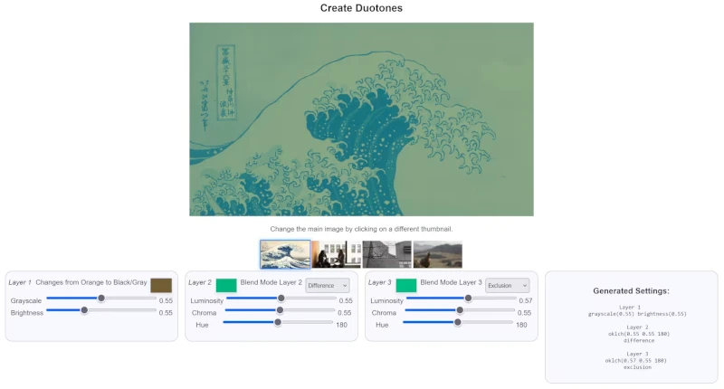

# Slip Sliding

## HTML Sliders

Input type="range" used by users to change the value of variables.
This site will guide you through the tricky HTML, CSS and JS to produce customised
sliders, static output, output as a balloon on the slider thumb. Finally how to
efficiently alter elements in your web site and produce applications.

### See the Working Copy
https:/
[Link](https://app.readthedocs.org/projects/slip-sliding/ "Slip Sliding README.md")