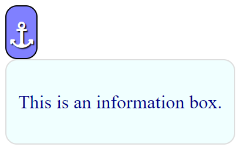

.. _anchor-pos:

======================
CSS Anchor Positioning
======================

This gives us the ability to tether two elements together. It also enables
us to specify alternative positions if the anchor position causes the tethered
element to overflow or rendered offscreen. We can also declare conditions when
the tethered element is to be hidden.

Older scripts would need to use javascript and the programmer would need to
calculate the positions of the anchor element, its size and the position and
size of the tethered item and what should occur if the anchor moves. Anchor
positioning involves no calculation. Just a few CSS clauses to indicate the
anchor and the tethered element and its position relative to the anchor.

In this basic example most of the script was about styling the **anchor** and
**infobox** the tethered element::

   

   
⚓︎

   

     
This is an information box.

   

|

|

When this script is run we see a mauve anchor in the upper left corner, sitting
underneath is the azure tethered element (infobox). The positioning used the
default setting from the browser.
What happens when the anchor moves - it becomes a bit more complicated.
This next example has an anchor inside a block of text, the tethered element
(infobox) sits on the right side of the anchor, separated by a margin. Hover
over the anchor it grows in size by expanding rightwards, which pushes the
tethered element rightwards as well, at the same time the margin is recalculated
and it enlarges as the anchor grows.

.. raw:: html

    
   

   

   <b> <i> Show/Hide Code </i> anchor-position-margin.html </b> 

    

   
   <legend>
   
Lorem ipsum dolor sit amet, consectetur adipiscing elit.

   

     Nisi quis eleifend quam adipiscing vitae proin sagittis nisl rhoncus. In arcu
     cursus euismod quis viverra nibh cras pulvinar.
   

   
⚓︎

   

     
Infobox.

   

   
Vulputate ut pharetra sit amet aliquam.

   

     Malesuada nunc vel risus commodo viverra maecenas accumsan lacus. Vel elit
     scelerisque mauris pellentesque pulvinar pellentesque habitant morbi
     tristique. Porta lorem mollis aliquam ut porttitor. Turpis cursus in hac
     habitasse platea dictumst quisque. Dolor sit amet consectetur adipiscing elit.
     Ornare lectus sit amet est placerat. Nulla aliquet porttitor lacus luctus
     accumsan.
   

   </legend>

   

|
