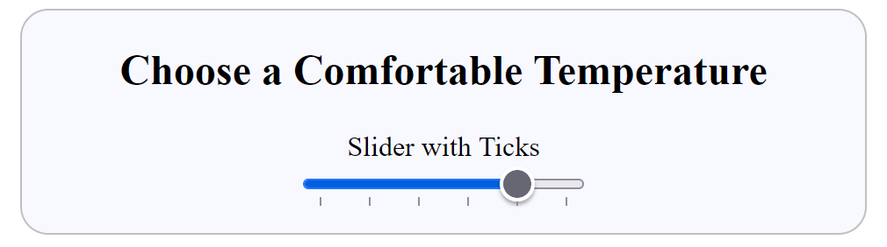

=======================
Adding Ticks and Labels
=======================

Add Ticks
=========

If you check on :ref:`Standard Attributes <slider-attr>` there is an attribute **list**
used when creating **ticks** (small vertical marks) along or in the trackway.
These ticks normally correspond to a set number of steps, often set to 10 or similar.
**list** is a pointer to a **datalist** where tick positions are made and is a
standard element used for a number of form inputs.

Starting from the minimalist slider add a datalist and point to it using the list
attribute::

      

         <h2>Budget</h2>
         <label>Slider with Ticks</label>
         <input type="range" min="0" max="50" value="40" step="10" list="steplist">
         <datalist id="steplist">
           <option>0 </option>
           <option>10</option>
           <option>20</option>
           <option>30</option>
           <option>40</option>
           <option>50</option>
        </datalist>
      

The datalist requires an identity (steplist), which is referenced by the list attribute.

.. raw:: html

    
   

   

   <b> <i> Show/Hide Code </i>10input-ticks.html </b> 

    

.. literalinclude:: ../_static/scripts/10input-ticks.html

.. raw:: html

   

|

.. |urarr|   unicode:: U+2197 .. UPRight ARROW

.. _in-ticks: ../_static/scripts/10input-ticks.html

.. |boat| image:: ../images/pbar-boat-a.avif
   :width: 36
   :height: 36
   :target: in-ticks_

|urarr| Click on the boat |boat| to see a slider with 6 ticks below the trackway.
If you can, check with other browsers
to see whether there are any differences. Because the steps correspond to the
datalist entries the slider will jump slightly from tick to tick, but will not settle
in between the ticks.

Adding Labels
=============

The datalist should be able to add **labels** as well as ticks. Let's change the
range and steps::

      <datalist id="steplist">
         <option label="0">0 </option>
         <option label="2.5">2.5 </option>
         <option label="5.0">5</option>
         <option label="7.5">7.5</option>
         <option label="10">10</option>
      </datalist>

The slider will need to range between 0 and 10, let's set the step to 2.5.

.. raw:: html

    
   

   

   <b> <i> Show/Hide Code </i>11change-ticks-add-labels.html </b> 

    

.. literalinclude:: ../_static/scripts/11change-ticks-add-labels.html

.. raw:: html

   

|

.. _inp-ticks: ../_static/scripts/11change-ticks-add-labels.html

.. |boat1| image:: ../images/pbar-boat-a.avif
   :width: 36
   :height: 36
   :target: inp-ticks_

|urarr| Click on the boat |boat1| to see the ticks but no labels.
There is no problem showing the
ticks as they are difficult to change, but the labels need styling - they may read
across or down the page.

First we need to style the datalist, let's set the slider width to 400px as well, make
sure the option has no hidden padding, then style the slider to match the datalist
width::

   datalist {
      display: flex;
      flex-direction: row;
      justify-content: space-between;
      width: 400px;
   }

   option {
      padding: 0;
   }

   input[type="range"] {
      width: 400px;
      margin: 0;
   }

|

.. raw:: html

    
   

   

   <b> <i> Show/Hide Code </i>11show-labels.html </b> 

    

.. literalinclude:: ../_static/scripts/11show-labels.html

.. raw:: html

   

|

.. _inp-ticks-show: ../_static/scripts/11show-labels.html

.. |boat2| image:: ../images/pbar-boat-a.avif
   :width: 36
   :height: 36
   :target: inp-ticks-show_

|urarr| Click on the boat |boat2| to see the slider, ticks and labels.
These style changes have
changed the slider width and the labels and ticks are about the same width. The ticks are
properly placed, but the labels are mostly slightly left of the true position.

If we change the label orientation so that they are all vertical, then the width of
each label is constant and not varying as with horizontal labels. Make the change within
the datalist styling::

   datalist {
      display: flex;
      flex-direction: column;
      justify-content: space-between;
      writing-mode: vertical-lr;
      width: 400px;
   }

The flex-direction is now **column** and we have added **writing-mode: vertical-lr;**,
(vertical left to right).

.. raw:: html

    
   

   

   <b> <i> Show/Hide Code </i>12labels-rotated.html </b> 

    

.. literalinclude:: ../_static/scripts/12labels-rotated.html

.. raw:: html

   

|

.. _lab-rot: ../_static/scripts/12labels-rotated.html

.. |boat3| image:: ../images/pbar-boat-a.avif
   :width: 36
   :height: 36
   :target: lab-rot_

|urarr| Click on the boat |boat3| and compare how this looks on
the various browsers. Firefox was well aligned, but the labels were too close to
the ticks, on the other browsers all the labels were slightly less wide than the ticks,
so 0 was slightly right and 10 was slightly left of where they should be.

What to do if we have wide labels and we have no wish to make them vertical?

