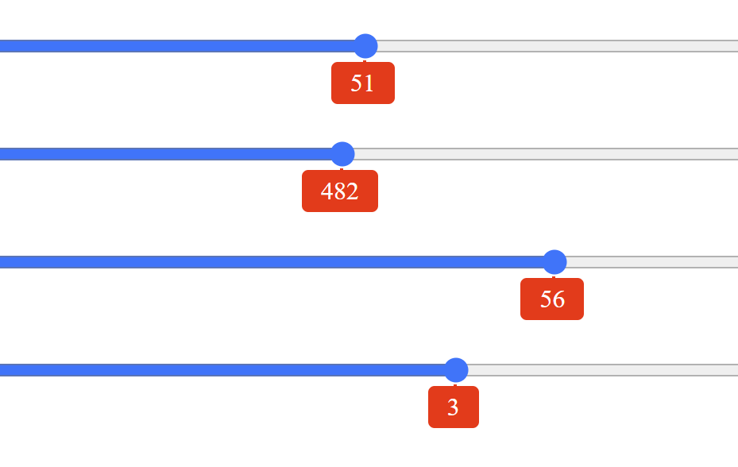

=================
Anchor the Bubble
=================

Former Plain Slider
===================

The bubble has been a difficult object to tie down to slider dimensions. The next
example comes from `css-tricks <https://css-tricks.com/value-bubbles-for-range-inputs/>`_
apart from using **innerText** instead of **innerHTML** there is no change. The original
describes how the calculation was made. Also since they are using plain sliders the only
special CSS styling is for the bubble.

.. raw:: html

    
   

   

   <b> <i> Show/Hide Code </i>40plain-bubble-sliders.html </b> 

    

.. literalinclude:: ../_static/scripts/40plain-bubble-sliders.html

.. raw:: html

   

|

.. |urarr|   unicode:: U+2197 .. UPRight ARROW

.. _plain-bubbles: ../_static/scripts/40plain-bubble-sliders.html

.. |boat| image:: ../images/pbar-boat-a.avif
   :width: 36
   :height: 36
   :target: plain-bubbles_

|urarr| Click on the boat |boat| to see
how well the sliders perform, they must be moved to see the bubble.
If the thumb does not move freely click in the trackway close to the thumb.
The output will show below the thumb. There are four horizontal sliders, each with
a different minimum, maximum, step and width.

Top Slider
   0 to 100 step 1, width 100%
Second Slider
   20 to 940 step 1, width 100%
Third Slider
   50 to 60 step 2, width 75%
Fourth Slider
   -20 to 20 step 1, width 55%

Run the html script on different browsers to see that the thumb reaches the trackway
ends and displays the correct values. Also make the browser window smaller,
the trackways should adjust automatically and still give the correct end values.

Updated Plain Sliders
=====================

The following method has been made following Temani Afif's comprehensive
guide on `Custom Range Slider Using Anchor Positioning <https://frontendmasters.com/blog/custom-range-slider-using-anchor-positioning-scroll-driven-animations/>`_.
We could have also used **scroll driven animations** to make the bubble move, but
this was left out as the amount of Javascript saved was not worth worrying about.

A bubble slider has the output showing above or below the thumb, when the
thumb moves the output moves with it. Until recently it was necessary to compute
the output position based on a calculation invariably involving Javascript.
If we position the output using :ref:`anchor positioning <anchor-pos>` CSS automatically takes
care of where the target (for us output) is relative to an anchor (our thumb),
even if the anchor is not static.

When we showed the four plain sliders the calculation was relatively obscure,
in that we would not have been able to come to this formula without a fair
bit of trial and error. Let's apply anchor positioning to this example, we
also should be able to simplify the Javascript for the output value::

   

     <input type="range" id="range1">
     <output id="bubble1"></output>
   

   

     <input type="range" id="range2" min="20" max="940">
     <output id="bubble2"></output>
   

   

     <input type="range" id="range3" min="50" max="60" step="2">
     <output id="bubble3"></output>
   

   

     <input type="range" id="range4" min="-20" max="20">
     <output id="bubble4"></output>
   

|

The html stays pretty much the same, just that the classes **range** and
**bubble** are now identities as the anchors and their targets have to be
unique. Each of the anchors require to initialise the anchor name, this
has to be duplicated because the thumb is described differently between
browsers::

   #range1::-webkit-slider-thumb {
      anchor-name: --thumb1;
   }

   #range1::-moz-range-thumb {
      anchor-name: --thumb1;
   }

|

All four slider thumbs are treated similarly. Each target is now linked
to each anchor::

   #bubble1 {
      position-anchor: --thumb1;
      position: absolute;
      position-area: top;
      margin-bottom: 5px;
   }

|

That's it, 10 lines of CSS and the bubble is now tied to the thumb, no calculation
required. Too good to be true? Well yes Firefox has a glitch using the thumb
as an anchor - hopefully to be resolved soon, but anchor positioning can be used
on most of the other browsers.

All we need do now is give the output some styling and use some Javascript
to make the output value the same as the slider value.

.. raw:: html

    
   

   

   <b> <i> Show/Hide Code </i>41four-sliders-bubbles-anchored.html </b> 

    

.. literalinclude:: ../_static/scripts/41four-sliders-bubbles-anchored.html

.. raw:: html

   

|

.. _anchored-bubbles: ../_static/scripts/41four-sliders-bubbles-anchored.html

.. |boat1| image:: ../images/pbar-boat-a.avif
   :width: 36
   :height: 36
   :target: anchored-bubbles_

|urarr| Click on the boat |boat1|
and see how well
the four sliders work.

.. hint::

   Don't forget to view using Chrome, Edge or Opera. Safari probably works and
   Firefox has a glitch using the slider thumb.

But hang on - those outputs cover the thumbs and seem to have been flipped
down from the top. And there was a lot of repetitious code in the CSS.

.. _simple:

Simplified Anchor Bubble
========================

Just as in Javascript we simplified the Listener for multiple inputs, so it
is possible to ensure that the targets and anchors refer to a unit, essentially
each slider is enclosed in a **label** tag, so we can dispense with the identities::

   <label>
     <input type="range">
     <output></output>
   </label>

   <label>
     <input type="range" min="20" max="940">
     <output></output>
   </label>

   <label style="width: 75%;">
     <input type="range" min="50" max="60" step="2">
     <output></output>
   </label>

   <label style="width: 55%;">
     <input type="range" min="-20" max="20">
     <output></output>
   </label>

|

We have lost the div tag with its class - so the html is starting to look
cleaner. The CSS now loses all those separate selections - we are doing the same
method for each one.

To preserve the layout when output is anchored, ensure that the label selection
has **position: relative;**, it also helps to keep the target attached to the
anchor::

   label {
      position: relative;
      width: 100%;
   }

|

This makes the target flip downwards, as seen in
the last example. At the target add::

   output {
   ...
      justify-self: unsafe anchor-center;
      align-self: unsafe end;
   }

|

The target is now positioned correctly as the browser no longer corrects for
layout. To ensure that the topmost slider does not lose space the layout was
adjusted. After all that the file size was just under 60% of the original anchor
file.

.. raw:: html

    
   

   

   <b> <i> Show/Hide Code </i>42four-slider-anchored-simplified.html </b> 

    

.. literalinclude:: ../_static/scripts/42four-slider-anchored-simplified.html

.. raw:: html

   

|

.. _anchored-simple: ../_static/scripts/42four-slider-anchored-simplified.html

.. |boat2| image:: ../images/pbar-boat-a.avif
   :width: 36
   :height: 36
   :target: anchored-simple_

|urarr| Click on the boat |boat2| and
try it out. Was it my imagination but didn't the sliders drag easier than the original, in
particular compare the third slider that has a min of 50 and a max of 60. Don't forget
to change the window size and see whether the slider shows the correct value at its
limits, also see how it looks in different browsers.

.. hint::

   Don't forget to view using Chrome, Edge or Opera. Safari probably works and
   Firefox has a glitch using the slider thumb as an anchor.

|

All fine and dandy but the sliders preened themselves for you but so far achieved
nothing.
