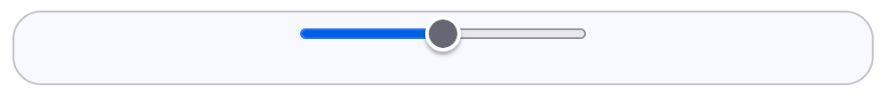

=====================
Calling-Up the Slider
=====================

A slider is an HTML element called with the **input** tag ``<input type="range" ...>``,
the **range** type being the slider, there follows several attributes which
require a value for the slider to operate as expected. As with many HTML multi-inputs
the :ref:`Attributes <slider-attr>` are listed with their name equal to its value in quotation marks::

   <input
   type="range"
   attrib0="value0"
   attrib1="value1"
   ....
   >

or spaced out in a row::

   <input type="range" attrib0="value0" attrib1="value1" ... >

Some of these attributes have default values, so a minimalist slider that exists
but does nothing useful can be made::

   <input type="range">

.. image:: ../images/input_type_range.avif
   :width: 300
   :height: 150
   :alt: slider

This creates a slider on the page with its trackway and thumb. The trackway
is the path and the round thumb is moved with the mouse.
On hover and left click the thumb changes colour indicating the user is present,
then move the thumb
along the trackway by dragging with the mouse all the while pressing the left mouse button.
Progress is the colour change along the left hand trackway from the end
to the thumb.

.. raw:: html

    
   

   

   <b> <i> Show/Hide Code </i> minimalist.html </b> 

    
.. literalinclude:: ../_static/scripts/minimalist.html

.. raw:: html

   

|

.. |urarr|   unicode:: U+2197 .. UPRight ARROW

.. _minim: ../_static/scripts/minimalist.html

.. |boat| image:: ../images/pbar-boat-a.avif
   :width: 36
   :height: 36
   :target: minim_

|urarr| Click on the boat |boat| to see this in action,
do not forget to use the browser left facing arrow to return to this page.

The browser has used several default settings to obtain this minimalist view.
Although unseen the value changed between 0 and 100 with its default setting of
halfway along the range (maximum value - minimum value)/2, in this case 50.
The sizes and colours of the trackway and thumb were set by the browser. In fact
there is a default step size of 1 but as the range was sufficiently large that the
the thumb movement appears smooth - if the range had only been 10 then the
step effect would be noticeable.
