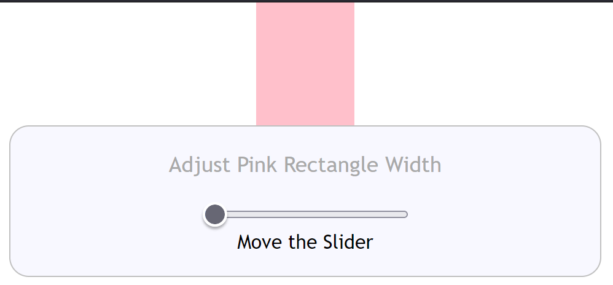

=================
Changing Elements
=================

To make a meaningful change the user has to be aware what the change is doing.
The reason the slider is useful is that just by dragging the thumb the value changes,
this visually alters an element and that provides useful interactive experience.
In comparison other methods are not so immediate - imagine only using text inputs.
The user should also be told what
to do - what may be
obvious to the programmer - might be unfathomable to others.

Simple Change
=============

When we created static output using a Javascript listener, a lot of the basic
change design was covered::

   
   

   <section>
     <legend>Adjust Pink Rectangle Width</legend>
     <input type="range" min="80" max="100"
     step="1" value="80" oninput="this.nextElementSibling.value = this.value">
   <output>Move the Slider</output>
   </section>
   
   

|

Our interest has shifted from creating an output as the slider moves to changing
an element's size (the width of the pink rectangle). The pink rectangle sits
in the div with the id **pinky**. As the slider moves the rectangle width changes.
The correct unit (px) must be included with the value to make the
change, the original width was 80px (see the CSS).

Inline Javascript changes the output and a listener is used to change
the element width, both dependant on the target value.

.. raw:: html

    
   

   

   <b> <i> Show/Hide Code </i>50adjust-width.html </b> 

    

.. literalinclude:: ../_static/scripts/50adjust-width.html

.. raw:: html

   

|

.. |urarr|   unicode:: U+2197 .. UPRight ARROW

.. _adj-width: ../_static/scripts/50adjust-width.html

.. |boat| image:: ../images/pbar-boat-a.avif
   :width: 36
   :height: 36
   :target: adj-width_

|urarr| Click on the boat |boat|
and adjust the rectangle
width.

Linking Change and Output
=========================

Since the width change and slider output can be controlled by similar Javascript,
remove the inline Javascript and change the listener script::

   

   <section>
     <legend>Adjust Pink Rectangle Width</legend>
     <input type="range" min="80" max="100"
     step="1" value="80">
   <output>Move the Slider</output>
   </section>

   

|

Add an extra assignment **e.target.nextElementSibling.value** for the output value.
This one change is all that is required for the listener - we can now remove the
inline Javascript.

.. raw:: html

    
   

   

   <b> <i> Show/Hide Code </i>51adjust-width-output.html </b> 

    

.. literalinclude:: ../_static/scripts/51adjust-width-output.html

.. raw:: html

   

|

.. _adj-width-out: ../_static/scripts/51adjust-width-output.html

.. |boat1| image:: ../images/pbar-boat-a.avif
   :width: 36
   :height: 36
   :target: adj-width-out_

|urarr| Click on the boat |boat1|
the slider should look no different
to the previous example apart from the units also appearing in the output.

Alright with one item changing the Javascript is straightforward, but what happens
in a multi-slider scenario?

Multiple Sliders Showing Values
===============================

The single slider changing the width of our test rectangle was reasonably
straightforward, we had to find the elements property and change it by using
a number and unit which together made the new value. The value change should
be easy as the Listener can find the slider, its value and hence its
output - we have already seen that the Listener can select which slider was changing
in the :ref:`Simplified Anchor Bubble <simple>` from four sliders.

Each slider needs to link to the Javascript information that shows what style component
is being changed also which units to use. Normally one finds the element by its
identifier, then we need to query the right part of the styling. On a small selection
we could use conditional clauses to find the right combination - but this doesn't
scale well. A more concise and straightforward solution is required.

We require dynamic variables in that they change
according to which slider is being used. This may seem like a pretty tall order
but fear not we have a working example which we can follow thanks to
`Mads Stoumann <https://dev.to/madsstoumann/build-a-css-ruler-2opn>`_

Each
slider gains a **name** attribute and an optional **data-suffix** attribute.
The name is given as its value the CSS variable name that is changed to affect
the relevant element,
while the data-suffix is the unit that the CSS variable uses. In our case we
will change the colour and width of our rectangle, which still means we have two
sliders and one listener.
Mads' example was more
complicated yet the Javascript was only five lines::

    

   

        <label>Change Width</label>
       <input type="range" name="--rect-w" min="80" max="120" value="80" data-suffix="px">
         <output>Move the Slider to Change Width</output>
        <label>Change Hue</label>
      <input type="range" name="--hue" min="0" max="360" value="0">
         <output>Move the Slider Change Colour</output>

   

   

|

The attribute name for the upper slider was the CSS variable ``--rect-w``, which
in effect gave us the element and which CSS property was being adjusted. This slider
also required ``data-suffix="px"``, this was picked up in Javascript by ``dataset.suffix``. The
upper output showed the value followed by **px**.

The lower slider changed the hue, this was picked up by its name ``--hue``. As there
was no data-suffix the empty alternative was used and the output just showed the slider
value.

.. raw:: html

    
   

   

   <b> <i> Show/Hide Code </i>52multi-adjust.html </b> 

    

.. literalinclude:: ../_static/scripts/52multi-adjust.html

.. raw:: html

   

|

.. _multi-adj: ../_static/scripts/52multi-adjust.html

.. |boat2| image:: ../images/pbar-boat-a.avif
   :width: 36
   :height: 36
   :target: multi-adj_

|urarr| Click on the boat |boat2|
to see the resulting changes.

Alright let's change something a bit more useful than a pink rectangle.

Align Slider Width to Ticks and Labels
======================================

We left the alignment of the slider :ref:`when split <my-split>` and its ticks and labels in the air.
The sizing was left to trial and error - if we use a slider the change is shown to
the user immediately. So other than setting up the method it is much quicker and
gives the user a more satisfying experience.

Most of the styling can be copied from the previous example 20split-labels-ticks-r1.html.

This time we alter a CSS variable directly setting the suffix in the Javascript. The
output is shown using inline Javascript, hence no suffix.

.. raw:: html

    
   

   

   <b> <i> Show/Hide Code </i>53adjust-slider-width.html </b> 

    

.. literalinclude:: ../_static/scripts/53adjust-slider-width.html

.. raw:: html

   

|

.. _adjust-width: ../_static/scripts/53adjust-slider-width.html

.. |boat3| image:: ../images/pbar-boat-a.avif
   :width: 36
   :height: 36
   :target: adjust-width_

|urarr| Click on the boat |boat3|
if required zoom-in with the browser
to enlarge the result. The adjusting slider has steps of 0.1, as it increases the
upper slider increases in width and the ticks from the datalist increase in step with
the slider enlarging. Between the minimum and maximum the labels should align with the ticks.
There is a slight discrepancy in Firefox at 87.2, in Chrome 87.2 is too large but 86.7
was a good fit which was also a good fit for Edge, Opera had its best fit at 85.6.

One slider and changing a piece of optional CSS, how about something with a bit
more general interest? Read on.
