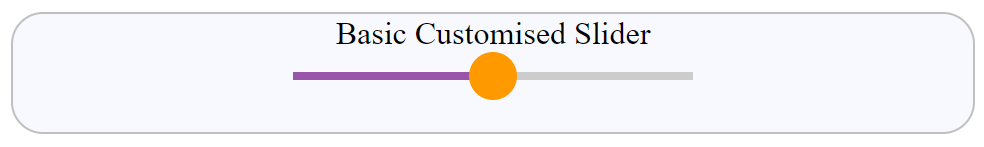

======================
Customising the Slider
======================

There are many examples of customisation on the internet, but for an overall view
of what is possible we are basing on what `Ana Tudor <https://css-tricks.com/sliding-nightmare-understanding-range-input/>`_
has written. This takes us through the main types a basic slider, adding ticks then
making a bubble output, where the output moves with the thumb. It has a detailed
account of how and why the CSS was changed and is worth reading in its own right.

Every change to the thumb, trackway and progress bar needs to be made in triplicate,
with each browser variant using different naming systems. Say we styled the trackway::

   input::-webkit-slider-runnable-track { /* common styles */ }
   input::-moz-range-track { /* common styles */ }
   input::-ms-track { /* common styles */ }

Using a CSS preprocessor we can simplify the method::

   @mixin track() { /* common styles */ }

   input {
      &::-webkit-slider-runnable-track { @include track }
      &::-moz-range-track { @include track }
      &::-ms-track { @include track }
   }

Now the common style is only written once. But fear not the scripts are written fully
so no preprocessor is required.

As Ana worked through her examples the Javascript was simplified using unqualified
Listeners like our earlier scripts. The other change was that the progress bar
was added where the original example had none.

Basic Customised Slider
=======================

This example had a progress bar and was used as a template for those examples lacking a
progress bar.

.. raw:: html

    
   

   

   <b> <i> Show/Hide Code </i>30basic-custom-slider-r1.html </b> 

    

.. literalinclude:: ../_static/scripts/30basic-custom-slider-r1.html

.. raw:: html

   

|

.. |urarr|   unicode:: U+2197 .. UPRight ARROW

.. _base-custom: ../_static/scripts/30basic-custom-slider-r1.html

.. |boat| image:: ../images/pbar-boat-a.avif
   :width: 36
   :height: 36
   :target: base-custom_

|urarr| Click on the boat |boat| to see the basic customised slider which
is similar
to the minimalist slider except that now if viewed on different browsers it 
should look the same. The Javascript drives the progress bar.

Customised Slider with Ticks
============================

When adding ticks previously we added a datalist, now we have to also add CSS since
some browsers will place the ticks inside the trackway, others outside. A progress bar
was added.

The ticks have been placed at 0, 10, 30, 60 and 100.

.. raw:: html

    
   

   

   <b> <i> Show/Hide Code </i>31ticks-custom-progress-r1.html </b> 

    

.. literalinclude:: ../_static/scripts/31ticks-custom-progress-r1.html

.. raw:: html

   

|

.. _custom-ticks: ../_static/scripts/31ticks-custom-progress-r1.html

.. |boat1| image:: ../images/pbar-boat-a.avif
   :width: 36
   :height: 36
   :target: custom-ticks_

|urarr| Click on the boat |boat1| to see that the slider is grey,
it is not disabled, just click on the thumb to bring up the colours.

The positions of the labels can be individually set from a CSS variable.

Customised Bubble Slider
========================

The CSS will closely follow the basic customised slider, with some additional
JavaScript and styling of the bubble. The bubble is styled by **.js [type=range] ~ output**
in this case the output from the slider. The js class gets activated by Javascript.

As with the tick slider the progress bar was added by copying from the basic slider.

The wrapper was left unchanged as the bubble and thumb were easily made out of line.

Ana had managed the calculation of the bubble with CSS variables. Since the slider was customised
she already had the relevant dimensions to hand. If we used an unstyled slider finding
the true dimensions would not be so easy.

.. raw:: html

    
   

   

   <b> <i> Show/Hide Code </i>32custom-bubble-progress-r1.html </b> 

    

.. literalinclude:: ../_static/scripts/32custom-bubble-progress-r1.html

.. raw:: html

   

|

.. _custom-bubble: ../_static/scripts/32custom-bubble-progress-r1.html

.. |boat2| image:: ../images/pbar-boat-a.avif
   :width: 36
   :height: 36
   :target: custom-bubble_

|urarr| Click on the boat |boat2|
to see the bubble slider
in action.

We can simplify the process of tying the thumb to a
bubble.
