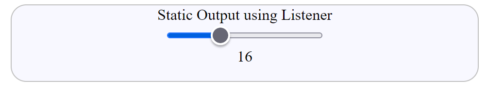

============
Fixed Output
============

Javascript for the Output
=========================

We require to know what the slider is doing when the thumb is moved. There already
exist enabling methods as for **form**. To complement our
input type="range" there is an **output** tag, this acts like
span, but is linked to input. It is usually placed next to its input
when set out in html::

    <input type="range" min="0" max="50" value="0">
        <output>0</output>

The output has an initial value which can be the same as the starting value,
but without any addition remains fixed at the starting value.

CSS can only style the slider and its output, therefore we require Javascript to make
the output change in accordance with the thumb position on the slider. The modern
approach is to use a :ref:`Listener <add-listener>` which identifies what is changing and
which element is making that change::

    

input
    The Listener is told to monitor **input** (a form element). In this case
    the slider.
event
    is the Listener's handle to the change, (this can be shortened to e).
=>
    arrow function, a simplified function
event.target
    the slider
event.target.value
    the slider's changing value
event.target.nextElementSibling
    the output, already tied to the input

The actual operation can be made by a simple assignment, no additional
function is required, since we are replacing one value (number) by another.

There is only one item changing at a time, so the Listener requires no prefix to
show what is changing. Also neither the input nor the output require an identity
or class.

The slider can acquire a **label** tab that informs the user what the slider is doing::

      

         <label>Static Output using Listener</label>
         <input type="range" min="0" max="50" value="0">
            <output>Move the Slider</output>
      

Output has a text to inform the user what to do.

Let's build upon our minimalist slider

.. raw:: html

    
   

   

   <b> <i> Show/Hide Code </i>00listener-static-output-r2.html </b> 

    

.. literalinclude:: ../_static/scripts/00listener-static-output-r2.html

.. raw:: html

   

|

.. |urarr|   unicode:: U+2197 .. UPRight ARROW

.. _st-out: ../_static/scripts/00listener-static-output-r2.html

.. |boat| image:: ../images/pbar-boat-a.avif
   :width: 36
   :height: 36
   :target: st-out_

|urarr| Click on the boat |boat| to see static output in action,
when you first move the slider thumb the instruction disappears to be replaced by values
that change as the thumb moves. Drag the thumb to both extremes of the trackway, the
least value should be 0 and the highest value 50.

Inline Javascript
=================

This approach is frowned upon since it clutters up the html, and the normal scripting
is pretty straightforward.

Building onto the html used before, we have the following::

      

         <label>Static Output using Listener</label>
         <input type="range" min="0" max="50" value="0"
                oninput="this.nextElementSibling.value = this.value">
            <output>Move the Slider</output>
      

oninput
    provides immediate feedback from html to javascript.
this
    points to the target of the code, in this case the slider.

nextElementSibling and value are the same as before for the normal Javascript.

.. raw:: html

    
   

   

   <b> <i> Show/Hide Code </i>01inline-js-static-output.html </b> 

    

.. literalinclude:: ../_static/scripts/01inline-js-static-output.html

.. raw:: html

   

|

.. _in-line: ../_static/scripts/01inline-js-static-output.html

.. |boat1| image:: ../images/pbar-boat-a.avif
   :width: 36
   :height: 36
   :target: in-line_
   
|urarr| Click on the boat |boat1| to see inline js static output in action.

The two Javascript methods should have no difference in output.

In many circumstances it makes sense to have a spinbox instead of the fixed output.
