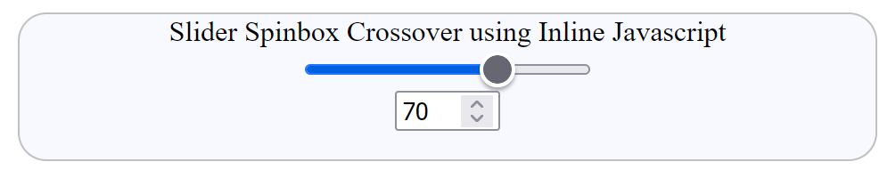

============================
Combining Slider and Spinbox
============================

The spinbox is another input type (part of form), called **number**. Numbers are
written into the spinbox or the value can be increased or decreased by pressing
on one of two
arrows. Most of its attributes
are similar to those used on the slider, but none have a default other than
**step** value.

Common Outputs
==============

In the first combination the slider output is shown on the spinbox and the spinbox
output moves the slider. All the attributes of the spinbox and slider are made equal.

Just as we used Javascript to change the output so we need Javascript to effect
the crossover::

      <input id="slider" type="range" value="70" oninput="amount.value=slider.value">
      <input id="amount" type="number" value="70" min="0" max="100" oninput="slider.value=amount.value">

The inline Javascript is succinct, all we need is to easily identify the two inputs,
and a couple of assignments and all is done. Obviously output is no longer
required.

.. raw:: html

    
   

   

   <b> <i> Show/Hide Code </i>02slide-spin-inline.html </b> 

    

.. literalinclude:: ../_static/scripts/02slide-spin-inline.html

.. raw:: html

   

|

.. |urarr|   unicode:: U+2197 .. UPRight ARROW

.. _spin-in: ../_static/scripts/02slide-spin-inline.html

.. |boat| image:: ../images/pbar-boat-a.avif
   :width: 36
   :height: 36
   :target: spin-in_

|urarr| Click on the boat |boat| to see a slider and spinner
both starting at a value of 70, change one and the other will follow.

Changing to normal Javascript we need to identify the listener inputs::

    slid = document.getElementById('slider');
    am = document.getElementById('amount');
    slid.addEventListener("input", e => {
        am.value = e.target.value;
    })
    am.addEventListener("input", e => {
        slid.value = e.target.value;
    })

|

.. raw:: html

    
   

   

   <b> <i> Show/Hide Code </i>03slide-spin-js.html </b> 

    

.. literalinclude:: ../_static/scripts/03slide-spin-js.html

.. raw:: html

   

|

.. _slide-spin: ../_static/scripts/03slide-spin-js.html

.. |boat1| image:: ../images/pbar-boat-a.avif
   :width: 36
   :height: 36
   :target: slide-spin_

|urarr| Click on the boat |boat1|, it should be similar to the previous example.

Since we are using javascrpt we can use the slider and spinbox as separate inputs
to a common output where the inputs are added after converting to numerals.

.. raw:: html

    
   

   

   <b> <i> Show/Hide Code </i>04slider-added-spin.html </b> 

    

.. literalinclude:: ../_static/scripts/04slider-added-spin.html

.. raw:: html

   

|

.. _slide-add-spin: ../_static/scripts/04slider-added-spin.html

.. |boat2| image:: ../images/pbar-boat-a.avif
   :width: 36
   :height: 36
   :target: slide-add-spin_

|urarr| Click on the boat |boat2|, the javascript is quite different.

There are circumstances when it is important to show the slider's limits and have
ticks and labels along the trackway.
