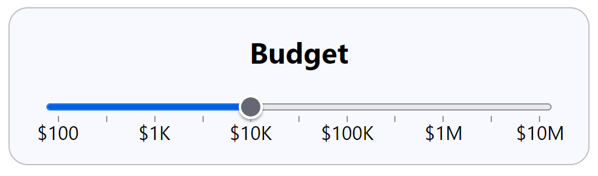

.. _my-split:

===============================
Split the Ticks from the Labels
===============================

The CSS has difficulty separately adjusting the ticks and labels when both are
incorporated into the datalist. The datalist and ticks are a good fit, also it is
difficult making ticks otherwise. The labels can be separated out and laid out in
several spans::

  <datalist id="steplist">
     <option>0</option>
     <option>10</option>
     <option>20</option>
     <option>30</option>
     <option>40</option>
     <option>50</option>
     <option>60</option>
     <option>70</option>
     <option>80</option>
     <option>90</option>
     <option>100</option>
  </datalist>
  

    $100
    $1K
    $10K
    $100K
    $1M
    $10M
  

The slider is going to be between 0 and 100, the datalist will supply the ticks. The
spans now have the labels. Both tick values and labels can be used without quotation marks.
We will have to guess the appropriate widths for the slider, datalist and spans.

The outer wrap in the slider-style.css has a width of 30em. A font-family is inserted
into :root so that we can measure to a known size in all operating systems::

    :root {
        font-family: system-ui, -apple-system, -apple-system-font, 'Segoe UI',
            'Roboto', sans-serif;
    }

    .labels {
        display: flex;
    }

    span {
        flex: 1;
    }

    /* manually adjust slider to look right */
    input[type="range"] {
        width: 80%;
        margin: auto
        cursor: grab;
    }

|

A first guess of the slider width is 80%. When first run the labels are bunched up,
so the root part of CSS is placed in the external script (as slider-style-r1.css).

.. raw:: html

    
   

   

   <b> <i> Show/Hide Code </i>20split-labels-ticks.html </b> 

    

.. literalinclude:: ../_static/scripts/20split-labels-ticks.html

.. raw:: html

   

.. |urarr|   unicode:: U+2197 .. UPRight ARROW

.. _split-ticks: ../_static/scripts/20split-labels-ticks.html

.. |boat| image:: ../images/pbar-boat-a.avif
   :width: 36
   :height: 36
   :target: split-ticks_

|urarr| Click on the boat |boat| to see the result -
in fact no change. After a bit of trial and error the problem seemed to lie with
the external script, bring root back and put wrap with the rest of styles.

.. raw:: html

    
   

   

   <b> <i> Show/Hide Code </i>20split-labels-ticks-r1.html </b> 

    

.. literalinclude:: ../_static/scripts/20split-labels-ticks-r1.html

.. raw:: html

   

|

.. _split-ticks-rev: ../_static/scripts/20split-labels-ticks-r1.html

.. |boat1| image:: ../images/pbar-boat-a.avif
   :width: 36
   :height: 36
   :target: split-ticks-rev_

|urarr| Click on the boat |boat1| to see the change.
The guess for the slider width was changed to 87.2%, we will return to this later.

So far the slider is shown in the browser default setting, each browser has its own
way of presentation and naming. If it is important to show a common style the slider
needs to be customised, and that is a fairly complex change.
